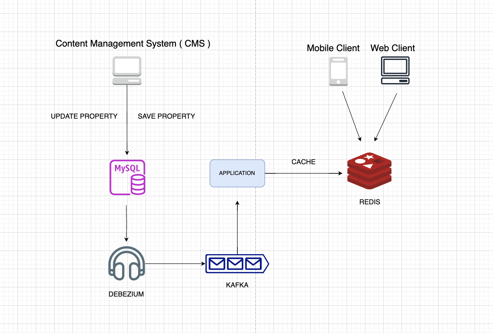

# Project Name

Spring Boot-Debezium for Change Data Capture (CDC)-Kafka-MySQL-Redis-Cacheable ( All in one comprehensive example )

## Tech Stack

- Java 21
- Spring Boot 3.3.0
- MySQL
- Apache Kafka
- Redis
- Debezium

## Medium

[Read the full article on Medium](https://medium.com/@htyesilyurt/spring-boot-debezium-for-change-data-capture-cdc-kafka-mysql-redis-cacheable-all-in-one-708ef5298cba)

## Architecture



## Installation

```shell
# Clone the repository
git clone hhttps://github.com/hendisantika/spring-boot-debezium-kafka-mysql-redis-cacheable.git

# Change directory
cd spring-boot-debezium-kafka-mysql-redis-cacheable

# Install dependencies
docker-compose up -d
```

- `Debezium Connector`

```shell
curl --location 'http://localhost:8083/connectors' \
--header 'Content-Type: application/json' \
--data '{
    "name": "property-connector",
    "config": {
        "connector.class": "io.debezium.connector.mysql.MySqlConnector",
        "database.allowPublicKeyRetrieval":"true",
        "database.hostname": "host.docker.internal",
        "database.port": "3307",
        "database.user": "debezium",
        "database.password": "S3cret",
        "database.include.list": "debezium",
        "table.include.list": "debezium.debezium_property",
        "topic.prefix": "property",
        "schema.history.internal.kafka.bootstrap.servers":  "kafka:9092",
        "schema.history.internal.kafka.topic": "schema-changes.db",
        "database.server.id": 1
    }
}'
```

- `Redis CacheManager`

```java

@Bean(value = "cacheManager")
public CacheManager redisCacheManager(RedisConnectionFactory redisConnectionFactory) {
    RedisCacheConfiguration redisCacheConfiguration = RedisCacheConfiguration.defaultCacheConfig()
            .disableCachingNullValues()
            .computePrefixWith(cacheName -> API_PREFIX.concat(SEPARATOR)
                    .concat(cacheName).concat(SEPARATOR))
            .serializeValuesWith(RedisSerializationContext.SerializationPair.fromSerializer(RedisSerializer.json()));
    redisCacheConfiguration.usePrefix();

    return RedisCacheManager.RedisCacheManagerBuilder.fromConnectionFactory(redisConnectionFactory)
            .cacheDefaults(redisCacheConfiguration).build();
}
```

- `Cacheable`

```java

@Cacheable(value = "property", cacheManager = "cacheManager", key = "#key")
public String cacheProperty(String key, String value) {
    return value;
}

@CacheEvict(value = "property", cacheManager = "cacheManager", key = "#key")
public void cacheEvict(String key) {
}
```

### List Commands

Add New Property

```shell
curl --location 'localhost:8080/v1/properties' \
--header 'Content-Type: application/json' \
--data '{
    "key": "212",
    "value": "YUJI"
}'
```

Get All Properties

```shell
curl --location 'http://localhost:8080/v1/properties/all'
```

Get Property By Key

```shell
curl --location 'localhost:8080/v1/properties?key=212'
```

Update Property

```shell
curl --location --request PUT 'localhost:8080/v1/properties' \
--header 'Content-Type: application/json' \
--data '{
    "key": "001",
    "value": "JUJUTSU"
}'
```
